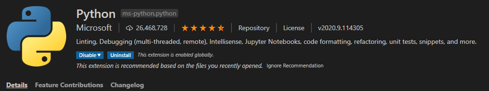
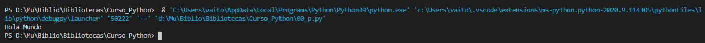
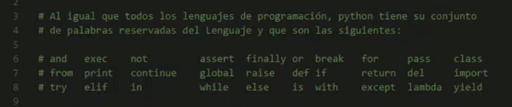
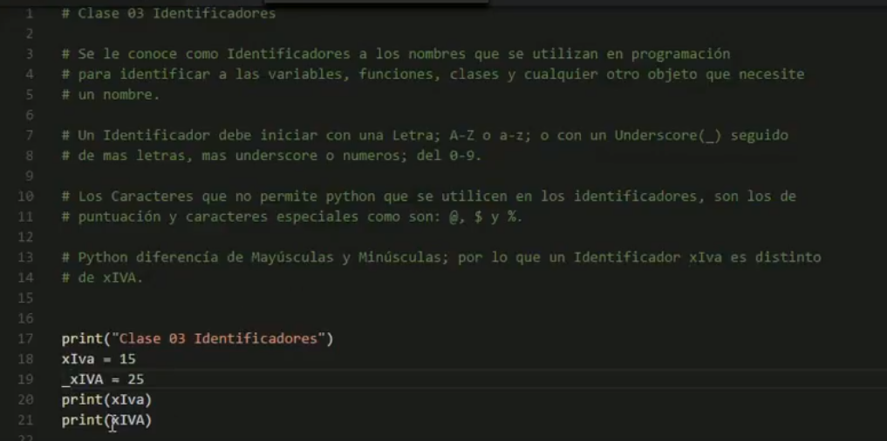

# Curso de python 

[link del curso](https://www.youtube.com/watch?v=qGZUc8rjmnA&list=PL1xeVkd9tTFjI1w_d99gO4IL_-aF-jyc_&index=4)

---

# Lección 1 Instalación

En este capítulo vimos lo que es instlar nuestro entorno de desarrollo:

- Visual code 
- Python el primer complemento que era posible ver




---

# El primer Hola mundo

escribimos el programa **00** con un simple hola mundo.

Para correrlo unicamente vamos a la opción de correr sin debugear como se parecia en la siguiente figura



Como dato curioso el complemento de python instalado tambien incluye herramienta para hacer debug.

---

# Lección 2 sintaxis básica 

## El .py no es estrictamente necesario

Es posible compilar progrmas que no cuenten con dicha extensión y aun así no se recomienda.

Comprobamos lo dicho guardando en dos archivos diferentes  'compila.py' y 'compila.txt'. 
Dentro de ellos escribiremos

```
print("mira mama si compilo")
```

Ejecute ambos y verá la verdad.

---

## Los comentarios

Es simple en python un comentario de una linea es 

```
# Esto es un comentario
```

---

# Una instrucción es demasiado larga

Es posible partir una un código de una linea demasiado largo en 2 lineas.


```
printf("que largooooooooooooooooooooooooooooooooooooooooooooooooooooo \
oooooooooooooooooooooooooooooooooooo);
```

---

# Lección 3 Palabras reservadas

Como todo lenguaje hay pbras que no se pueden usar para:
- Identificadores
- Nombres de variables
- etc



**Nota:** Recuerda que como Python es **case sensitive** yo puedo usar variables con el mismo nombre pero en 
mayúsuclas, ya que las palabras reservadas son en minúsuculas, aunque eso no es recomendable.

---

# Lección 4 Identificadores




---

Eso quiere decir que 


```
_variable ---> esta bien
_VAriable ---> es otra variable
$variable ---> produce error
9variable ---> Produce error
.variable ---> tambien error
```

Por signos de puntuación se refieren : ` , . - ; : `

---